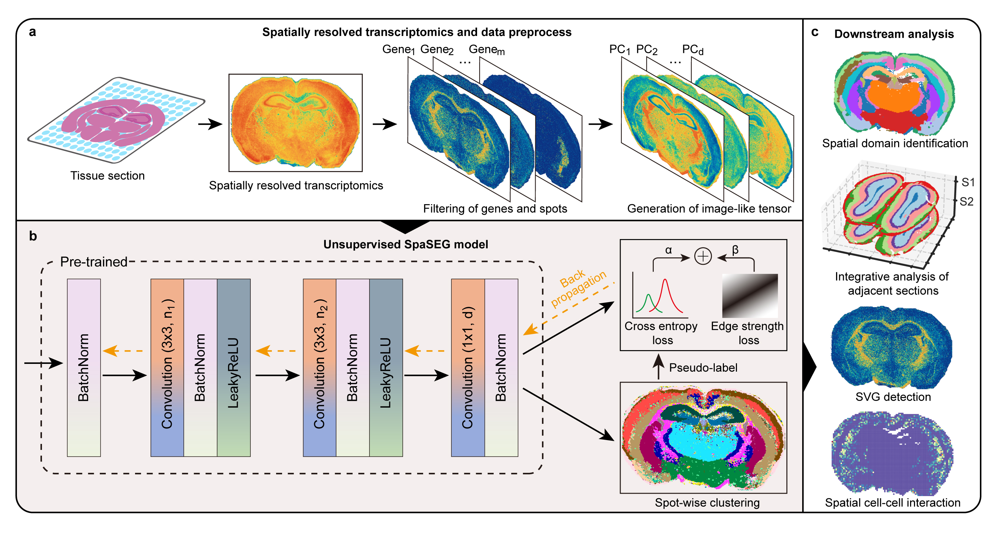

# Efficient reliability analysis of spatially resolved transcriptomics at varying resolution using SpaSEG
**SpaSEG**, an unsupervised convolutional neural network-based method towards multiple SRT analysis tasks by jointly learning transcriptional similarity between spots and their spatial dependence within tissue. SpaSEG adopts edge strength constraint to enable coherent spatial domains, and allows integrative SRT analysis by automatically aligning spatial domains across multiple adjacent sections. Moreover, SpaSEG can effectively detect spatial domain-specific gene expression patterns(SVG), and infer intercellular interactions and co-localizations.

## Overview of SpaSEG


## Dependency libraries  requirement

To run SpaSEG and perform downstream analyses, following dependency libraries are needed:

```
Pytorch == 1.12.0
Python ==3.9
opencv-python ==4.7.0
Squidpy == 1.2.3
cell2location == v0.8a0
scanpy >=1.9.1
pandas >=1.5.1
numpy >=1.22.4
matplotlib >=3.6.0
seaborn >=0.11.0
sklearn >=1.2.2
shapely == 2.0.1
numba >= 0.55.2

```


## Running SpaSEG
```
usage: spaseg_main.py [-h] [--experiment_name EXPERIMENT_NAME] [--platform PLATFORM] [--Stereo_data_type STEREO_DATA_TYPE] [--in_file_path IN_FILE_PATH]
                      [--cache_file_path CACHE_FILE_PATH] [--sample_id_list SAMPLE_ID_LIST [SAMPLE_ID_LIST ...]] [--batch_size BATCH_SIZE] [--min_cells MIN_CELLS]
                      [--compons COMPONS] [--drop_cell_ratio DROP_CELL_RATIO] [--seed SEED] [--out_file_path OUT_FILE_PATH]
                      [--processed_file_path PROCESSED_FILE_PATH] [--gpu_device GPU_DEVICE] [--lr LR] [--weight_decay WEIGHT_DECAY] [--pretrain_epochs PRETRAIN_EPOCHS]
                      [--iterations ITERATIONS] [--alpha ALPHA] [--beta BETA] [--minLabel MINLABEL] [--input_dim INPUT_DIM] [--nChannel NCHANNEL] [--nConv NCONV]
                      [--output_dim OUTPUT_DIM] [--ground_truth_index GROUND_TRUTH_INDEX] [--barcode_index BARCODE_INDEX] [--spot_size SPOT_SIZE] [--scanpy_process]
                      [--use_gpu]

SpaSEG model

optional arguments:
  -h, --help show this help message and exit
  --experiment_name EXPERIMENT_NAME
  --platform PLATFORM
  --Stereo_data_type STEREO_DATA_TYPE
                        Specify Stereo-seq input data types: cellBin or binCell
  --in_file_path IN_FILE_PATH
  --cache_file_path CACHE_FILE_PATH
  --sample_id_list SAMPLE_ID_LIST [SAMPLE_ID_LIST ...]
                        Enter a list of input sample
  --batch_size BATCH_SIZE
                        number of batch_size
  --min_cells MIN_CELLS
  --compons COMPONS
  --drop_cell_ratio DROP_CELL_RATIO
  --seed SEED
  --out_file_path OUT_FILE_PATH
  --processed_file_path PROCESSED_FILE_PATH
  --gpu_device GPU_DEVICE
  --lr LR
  --weight_decay WEIGHT_DECAY
  --pretrain_epochs PRETRAIN_EPOCHS
  --iterations ITERATIONS
  --alpha ALPHA
  --beta BETA
  --minLabel MINLABEL
  --input_dim INPUT_DIM
  --nChannel NCHANNEL
  --nConv NCONV
  --output_dim OUTPUT_DIM
  --ground_truth_index GROUND_TRUTH_INDEX
                        specify the true label index of the spots
  --barcode_index BARCODE_INDEX
                        specify the barcode index of the spots
  --spot_size SPOT_SIZE
  --scanpy_process
  --use_gpu
```

## Example

``` python

# running SpaSEG on the DLPFC 151673 section
python spaseg_main.py --experiment_name baseline --scanpy_process --use_gpu --in_file_path ./data/DLPFC --sample_id 151673 --ground_truth_index celltype --spot_size 100 --minLabel 7


# running SpaSEG multiple adjacent sections （sectoins 151673, 151674, 151675, and 151676 in the DLPFC datasets ）
python spaseg_main.py --experiment_name multisection --in_file_path ./data/DLPFC --sample_id 151673 151674 151675 151676 --compons 30 --input_dim 30 --nChannel 30  --output_dim 30 --alpha 0.2 --beta 0.4 --ground_truth_index celltype --spot_size 100 --minLabel 7

```

## Downstream analysis
* **Identification of spatial domains for SRT datasets generated by a range of different platforms** 
`Stereo-seq mouse brain hemibrain cellBin data` MB CellBin cluster: [MB_cellBin_cluster](notebook/MultiPlatform/Fig3_cellbin_cluster.ipynb)
  
`Mouse somite-stage embryo seqFISH data` seqFISH cluster: [seqFISH_cluster](notebook/MultiPlatform/Fig3_seqfish_celltype_annotation.ipynb)
  
`Mouse hypothalamic preoptic region MERFISH data` merfish cluster: [MERFISH_cluster](notebook/MultiPlatform/Fig3_merfish_celltype_annotation.ipynb)

* **Identification of spatial domains for SRT datasets at various resolutions (large capture size)** 

`Whole adult mouse brain Stereo-seq data` at resolution Bin20, Bin50, Bin100, Bin200: [MB_multi_resolution](notebook/MultiPlatform/Fig3_mouse_brain_resolutions_algorithms.ipynb)

* **Multisection**:
For details in multi-section analysis, please refer to the MultiSection subfolder of notebook directory. 
  
  `10X DLPFC sample 151673-151676` multi-section demo: [DLPFC 151673-151676](notebook/MultiSection/ms-1515_clustering.ipynb)
  
  `10X mouse brain` posterior and anterior sections demo: [10X mouse brain](notebook/MultiSection/ms-mouse_brain_clustering.ipynb)
  
  `Stereo-seq mouse olfactory` multi-sections demo: [Stereo-seq mouse olfactory](notebook/MultiSection/ms-mouse_olfa_clustering.ipynb)

* **SVG**:
For detail spatial variable gene detection analysis, please refer to the SVG subfolder of notebook directory.
  
  `DLPFC sample 151673` SVG analysis demo: [151673_SVG](notebook/SVG/svg_151673_filter.ipynb)
  
  `Stereo-seq mouse embryo` SVG analysis demo: [Stereo-seq ME](notebook/SVG/svg_ME_filter.ipynb)
  
  `10X IDC` SVG analysis: [10X IDC](notebook/IDC/svg_IDC_filter.ipynb)

* **CCI**:
For detail cell-cell interaction analysis, please refer to the CCI and IDC subfolder of notebook directory.

  `Cell type deconvolution` for stereo-seq mouse brain and 10X IDC: [MB_deconvolution](notebook/deconvolution/cell2location_mouse_brain_bin200_N_30_alpha_200.ipynb), [IDC_deconvolution](notebook/deconvolution/cell2location_IDC_N_30_alpha_200_preprocessed.ipynb)
  
  `Cell cell interaction analysis` to get domain specific LR score per spot: [cci analysis](notebook/CCI/cci_analysis_notebook.ipynb)

  `Cell type correlation heatmap`: [heatmap_cor](notebook/CCI/Mouse_brain_bin200_LR_CT_corr_heatmap.ipynb)
  
  `Cell type colocalization` spatial visualization: [colocalization_spatial](notebook/CCI/CCI_colocalization_MB.ipynb)
  
  `Cell type specific Ligand and Receptor` expression: [LR expression](notebook/CCI/Mouse_brain_dotplot_LR_celltype.ipynb)

## Overview of cell-cell interaction analysis in SpaSEG
<div align="left">

</div>
